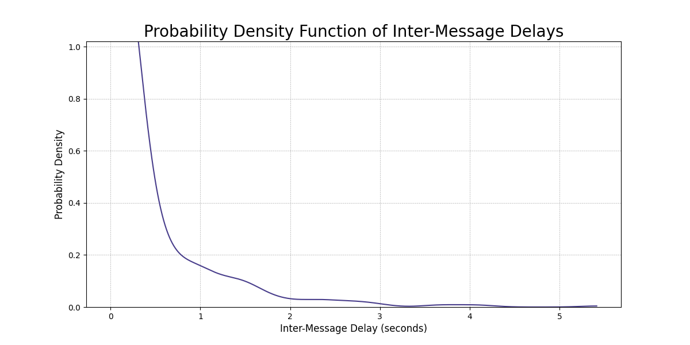

## Project: WhatsApp Packets Traffic Analysis and Visualization

This project involves capturing network packets, extracting WhatsApp messages, generating various plots, and saving results.

### Introduction

Modern Instant Messaging (IM) applications, including WhatsApp, rely on encrypted communication to ensure data privacy and security. In this encryption context, an attacker with access to someone's network traffic might be able to analyze patterns and timings of message transmission within a group to make certain inferences. While the content and metadata of messages remain encrypted, the timings and frequencies of messages can provide insights into group interactions.

### Project Structure

- `src/`: Contains Python script files.
- `resources/`: Contains pcap files for analysis.
- `res/`: Stores generated plots.
- `main.py`: Main script for packet capture, CSV conversion, and plot generation.
- `whatsapp_analysis.py`: Script for analyzing WhatsApp messages and creating plots.

### How to Use

1. Ensure you have Python installed.
2. Install the required packages using `pip install numpy pyshark matplotlib`.
3. **Important Note:** You need to obtain the pcap files on your own. We recommend using Wireshark to capture network traffic. Make sure to name each pcap file following the format "<x>s_record" (e.g., "Messages_record"). Additionally, manually add "x" as an element in the `GROUPS` list within the `main.py` script.
4. Place the pcap files you've acquired in the `resources/` folder.
5.  Run the command below.

#### Running

Run the next `python` command to convert packet captures to CSV format and generate plots:
```python
python .\src\main.py
```

#### The script performs the following steps:

1. Converts pcap files to CSV format with packet information in the `resources/` folder.
2. Generates plots in the `res/` folder to analyze inter-message delays, message sizes, and probability density functions.
----
### Plots and Analysis
1. **Inter-Message Delay Plot:** This plot shows the time delay between consecutive messages in a specific WhatsApp group. It highlights the temporal patterns of message transmission within the group.

2. **Probability Density Function (PDF) Plot:** The PDF plot provides a visual representation of the probability distribution of inter-message delays. It helps to visualize the likelihood of different delays between messages in the group.

3. **Message Size Plot:** This plot depicts the sizes of messages over time. It enables the observation of variations in message lengths and potential trends within the communication.

Please see the `res/` folder for the generated plots corresponding to each analysis.

----

### Comparing filtered and unfiltered traffic
An alternate analysis option within the project involves examining two distinct scenarios represented by the `YesFilter` and `NoFilter` pcap files. In this scenario, by changing the `GROUPS` parameter to `['YesFilter', 'NoFilter']`, the project shifts its focus to analyzing the connection patterns between messages in filtered and unfiltered traffic.

To perform this analysis, two distinct pcap files are utilized: one filtered for WhatsApp traffic using specific criteria (port 443, Meta server, and TLS protocol), and the other remaining unfiltered. This allows for a comparative study of the communication characteristics under different conditions.

An interesting application of this analysis arises in the realm of potential security concerns. In cases where an attacker gains access to a user's traffic and is also capable of sending messages within a specific group, they could employ this information to cross-reference whether packets they sent at a given time and with specific characteristics align with the user's traffic. This alignment could enable an attacker to infer if their own packets were successfully transmitted within the user's communication flow.


-----

### Contributors
This project was done by Alon Meshulam and Israel Gitler as the final project of "Communication Networks" course.

### References
Bahramali, A., Houmansadr, A., Soltani, R., Goeckel, D., & Towsley, D. (2020). [Practical traffic analysis attacks on secure messaging applications](https://www.ndss-symposium.org/wp-content/uploads/2020/02/24347-paper.pdf). Network and Distributed System Security (NDSS) Symposium.